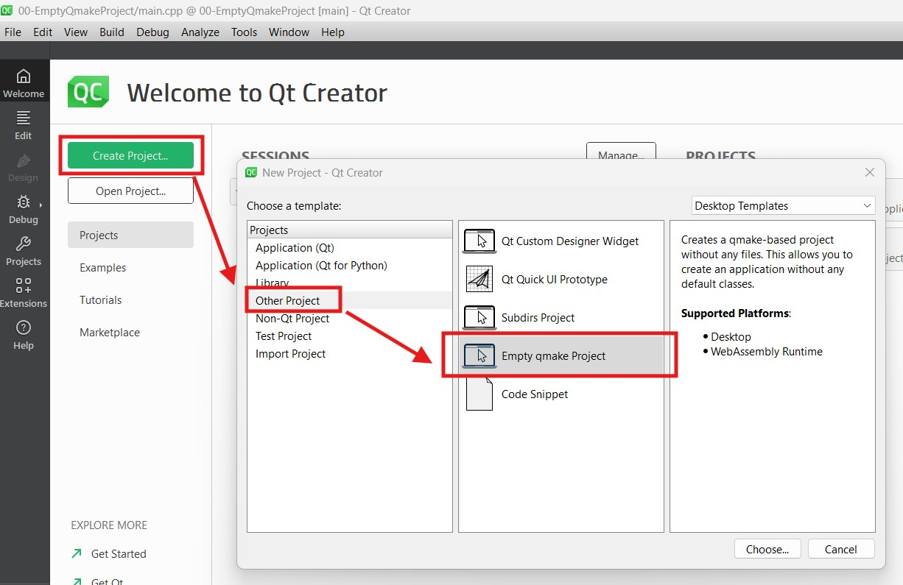
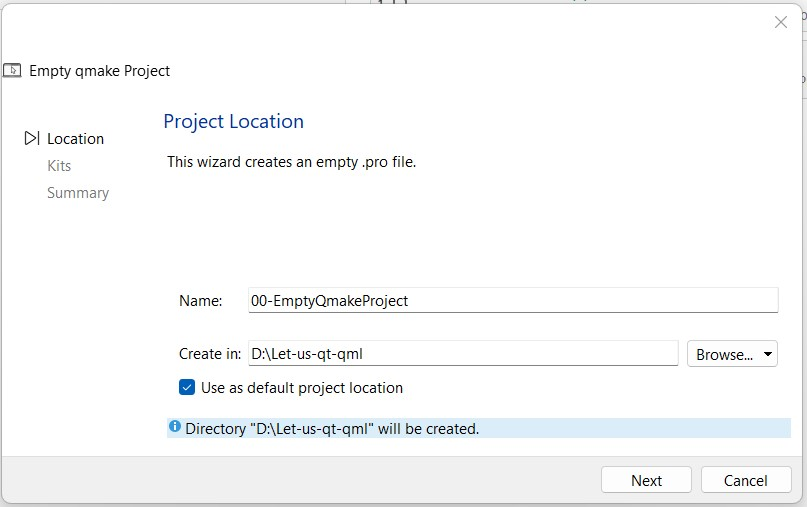
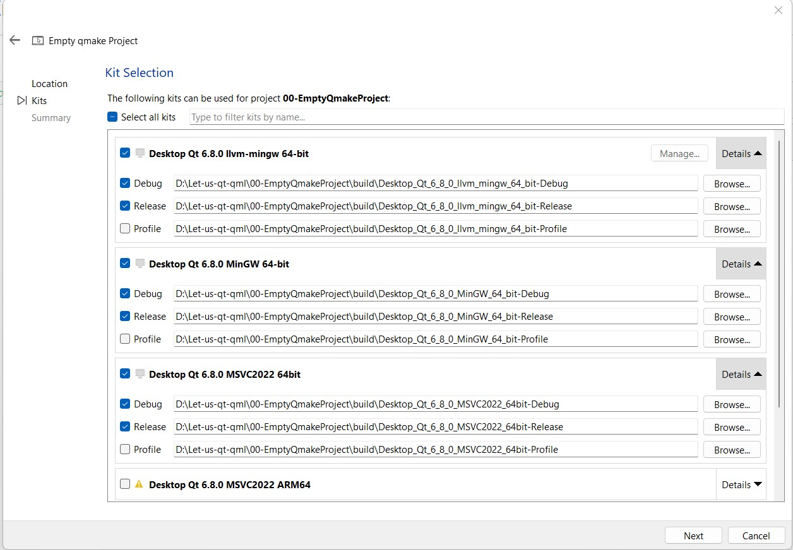
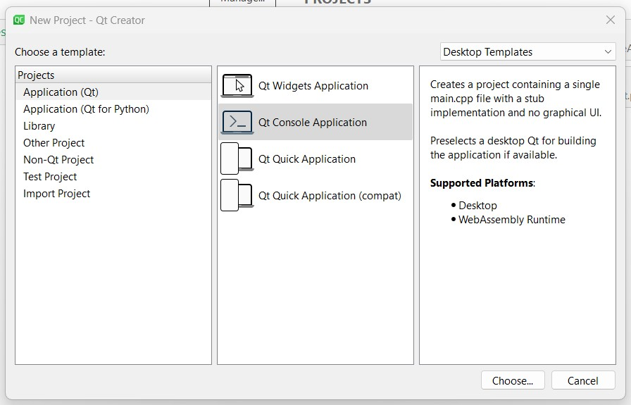
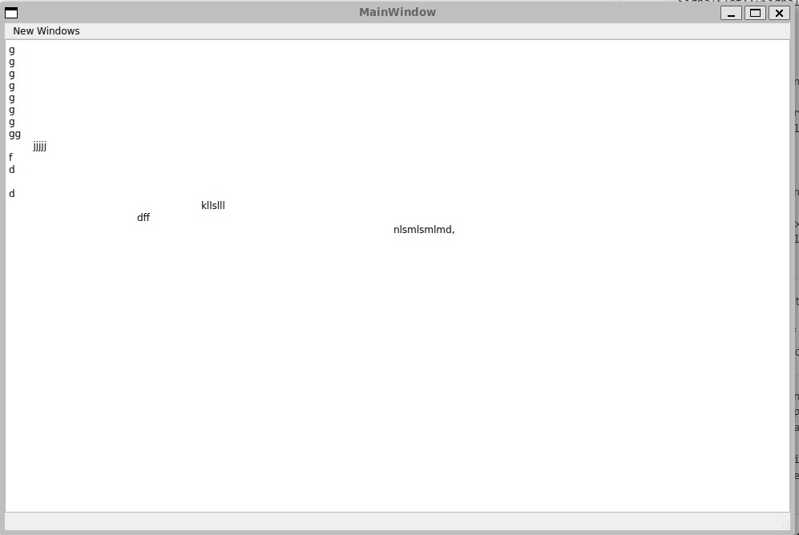

# Let Us QT/QML 

Before starting anything regarding tutorial. let's talk about installation process. QT/QML is available for all 3 Operating system anlog with mobile ansd web development. I have install QT on windows.

**QT installation on WIndows:**

+ go for download page [QT download here](https://www.qt.io/download-qt-installer-oss)
+ there is online and offline version you can go wwith either choice.
+ I tried online version and i face issue, and solution for that is: "**.\qt-online-installer-windows-x64-4.8.1.exe** --mirror http://www.nic.funet.fi/pub/mirrors/download.qt-project.org"
+ where **.\qt-online-installer-windows-x64-4.8.1.exe** is qt download installe, and "--mirror http://www.nic.funet.fi/pub/mirrors/download.qt-project.org" is a parameter. 


After intallation of QT Creaator, it is very new for me to write program in it. Let's start **Hello World** program.

**`Program-00:`** Write a program to simple **Hello World** print on console. 

**00-EmptyQmakeProject**

+ Open QT Creator and from **File->New Project** or make sure **Welcome(Home)** button is selected.
+ In new Project template, choose **other project** from letf hand side project template and then select **Empty qmake project**. see image below.

+ Next, Give Project name as - **00-EmptyQmakeProject** and arespective path and check the default project location. and click next.

+ Now it will promt for Kit selection, For my case I selected all three Debug and Release configuration. However it is not need to selected all three. it is depence upn you target for which you developing your application like some device or mobile (Andriod or Applle) or Desktop application.

+ Next, don't select anything simply click on finish. 

In seconds you will find project get created in Project explorer with name of **00-EmptyQmakeProject.pro** and **00-EmptyQmakeProject.exe**, You observe that, this is empty project. so, Now we need to add atleast one .cpp file like main.cpp. Write click on project and click on Add New and select c/C++ file and give name as main.cpp. and write and Hello World program into main.cpp file as below.

```
#include <iostream>
using namespace std;

int main()
{
    cout<<"Hello World"<<endl;
    return 0;
}
```
+ To compile this program, right click on project - **00-EmptyQmakeProject.pro** and build once build succefull then run. smae build and run is possible left-below icon. 

output:

**`Program:01`** Worite a program to print **Hello, Qt Console App!**. using QSting project type should be Qt Console application.

**01-FirstQtConsoleApplication**


```
#include <iostream>
#include <QString>
using namespace std;

int main()
{
    QString name = "Qt Console App";
    cout << "Hello, " << name.toStdString() << "!" << endl;
    return 0;
}
```

output:
>Hello, Qt Console App!


**`Program-02`**  Write a program to print **Hello World** on console but using QSting and qDebug().

**02-qDebug**
+ Create a "Qt Console Application" name as **02-qDebug**. 
+ Once you created Qt Console Application by default code is written. 
    ```
    #include <QCoreApplication>
    int main(int argc, char *argv[])
    {
        QCoreApplication a(argc, argv);
        return a.exec();
    }
    ```

+ Add QString and QDebug header file to the project.
    ```
    #include <QCoreApplication>
    #include <QString>
    #include <QDebug>
    int main(int argc, char *argv[])
    {
        QCoreApplication a(argc, argv);
        return a.exec();
    }
    ```
+ Anything in between QCoreApplication a(argc, argv) and return a.exec() we can write as considering Qt application.
    ```
    #include <QCoreApplication>
    #include <QString>
    #include <QDebug>
    int main(int argc, char *argv[])
    {
        QCoreApplication a(argc, argv);
        QString qstr = "Hello Nadim, How are you?!";
        qDebug()<<"Yes, " + qstr;
        qDebug()<<"I heard about you. all good?";
        qDebug("I believe, You belong to Distict Supaul, BIHAR");
        return a.exec();
    }
    ```

**Output:** 

    "Yes, Hello Nadim, How are you?!"
    I heard about you. all good?
    I believe, You belong to Distict Supaul, BIHAR


**Question (1) -** What is qDebug?

**Answer:** The QDebug class provides an output stream for debugging information. **qDebug** is used whenever the developer needs to write out debugging or tracing information to a **device, file, string or console**.

**Example:** 
```
qDebug() << "Date:" << QDate::currentDate();
qDebug() << "Types:" << QString("String") << QChar('x') << QRect(0, 10, 50, 40);
```

### QT GUI Application.

**`Program-03`**  Write a first GUI program.
**03-FirstQtWidgetApp**

+ Let's write first basic GUI application in Qt Creator. **03-FirstQtWidgetApp**
+ Select project template as - Application (Qt) -> Qt Widget Application.
+ provide Project Name and Locations..
+ Project with created as **03-FirstQtWidgetApp**, You can locate in project explorer. 
+ And it is contain 03-FirstQtWidgetApp.pro file which mean project file similar like vcproj in VC++. and along with folders: Header, Source and Forms.
+ Header folder contain, mainwindow.h file and Source folder contain - mainwindow.cpp and main .cpp and Form folder contain mainwindow.ui file which is similar to .rc (resource file) in MFC.

**`Program-04`**  Write a program to understand signal and slot with help of slider and progress bar.
**04-MyProgressbar**
+ In this project you will learn signal and slot using slider bar with progress bass. 
+ Slider bar generate signal and which recieve by Progress bar. 
+ **connect(ui->horizontalSlider_2, SIGNAL(valueChanged(int)), ui->progressBar_2, SLOT(setValue(int)))**


**`Program-05`**  Write a program to understand Signal and Slot.
**05-SignalandSlot**

**signalslot.h**
```
#ifndef SIGNALSLOT_H
#define SIGNALSLOT_H

#include <QMainWindow>

QT_BEGIN_NAMESPACE
namespace Ui
{
    class SignalSlot;
}
QT_END_NAMESPACE

class SignalSlot : public QMainWindow
{
    Q_OBJECT

public:
    SignalSlot(QWidget *parent = nullptr);
    ~SignalSlot();

private slots:
    void on_pushButton_enable_signalslot_clicked();
    void on_pushButton_disable_signalslot_clicked();

private:
    Ui::SignalSlot *ui;
};
#endif // SIGNALSLOT_H
```
**signalslot.cpp**
```
#include "signalslot.h"
#include "ui_signalslot.h"

SignalSlot::SignalSlot(QWidget *parent)
    : QMainWindow(parent)
    , ui(new Ui::SignalSlot)
{
    ui->setupUi(this);
    ui->pushButton_enable_signalslot->setText("Enable Signal Slot");
    ui->pushButton_disable_signalslot->setText("Disable Signal Slot");

}

SignalSlot::~SignalSlot()
{
    delete ui;
}

void SignalSlot::on_pushButton_enable_signalslot_clicked()
{
    connect(ui->horizontalSlider_signalslot, SIGNAL(valueChanged(int)), ui->progressBar_signalslot, SLOT(setValue(int)));
}


void SignalSlot::on_pushButton_disable_signalslot_clicked()
{
    disconnect(ui->horizontalSlider_signalslot, SIGNAL(valueChanged(int)), ui->progressBar_signalslot, SLOT(setValue(int)));
}
```

**`Program-06`** Create a notepad application using QT Application

To create notepad kind of application, Create Qt Widget application and add plaintext widget to *.ui file and then use below method "setCentralWidget()" inside constructor.
as seen image below

```
MainWindow::MainWindow(QWidget *parent)
    : QMainWindow(parent)
    , ui(new Ui::MainWindow)
{
    ui->setupUi(this);
    setCentralWidget(ui->PLAIN_TXT_EDIT);
}
```
+ setCentralWidget() to make notepad application.
+ where PLAIN_TXT_EDIT is id of plaintext widget.


### Modal and Modalless Dialog

**Question** How to create modal and modalless dialog. it is very simillar to MFC & Win32 applications.
 
 To create to modal and modalless dialog, right clickk on **form->Add New** and then from choose template select **QT** and select **Qt Designer Form Class**

 and then choose dialog with button and click next. it get addede another 

 ```
    #include "mnadialog.h"
    
    mnaDialog mnaDlg;
    mnaDlg.setModal(true);
    mnaDlg.exec();
 ```