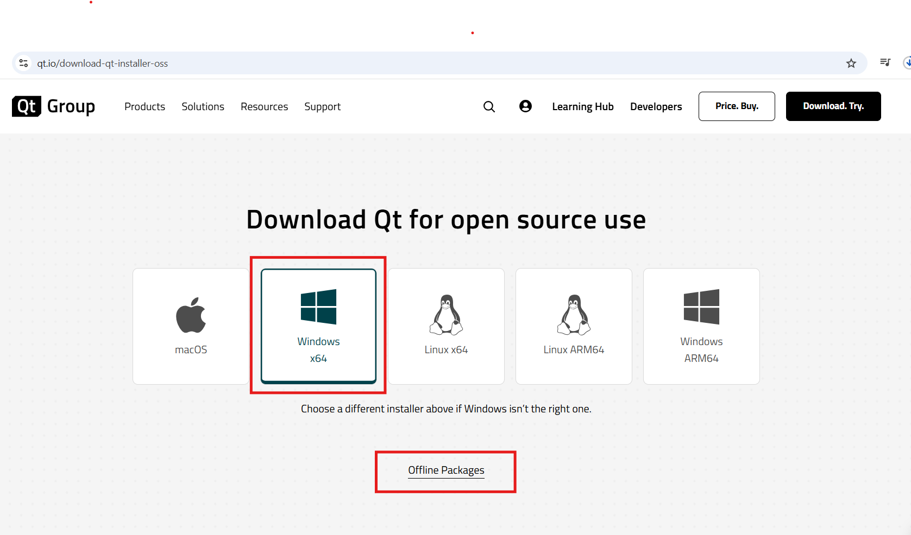

# Let Us QT/QML 

Before starting anything regarding tutorial. let's talk about installation process. QT/QML is available for all 3 Operating system anlog with mobile ansd web development. I have install QT on windows.

**QT installation on WIndows:**

+ go for download page [QT download here](https://www.qt.io/download-qt-installer-oss)
+ there is online and offline version you can go wwith either choice.
+ I tried online version and i face issue, and solution for that is: "**.\qt-online-installer-windows-x64-4.8.1.exe** --mirror http://www.nic.funet.fi/pub/mirrors/download.qt-project.org"
+ where **.\qt-online-installer-windows-x64-4.8.1.exe** is qt download installe, and "--mirror http://www.nic.funet.fi/pub/mirrors/download.qt-project.org" is a parameter. 

